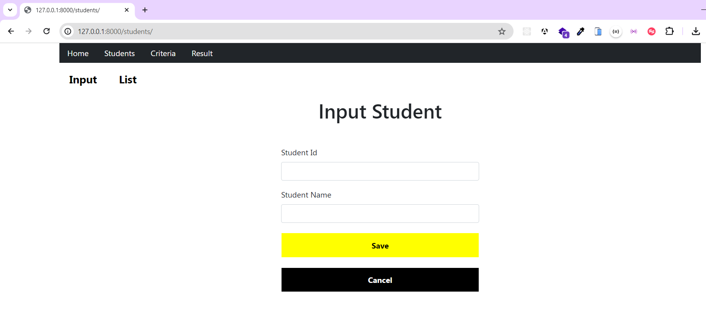
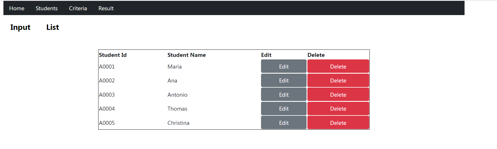
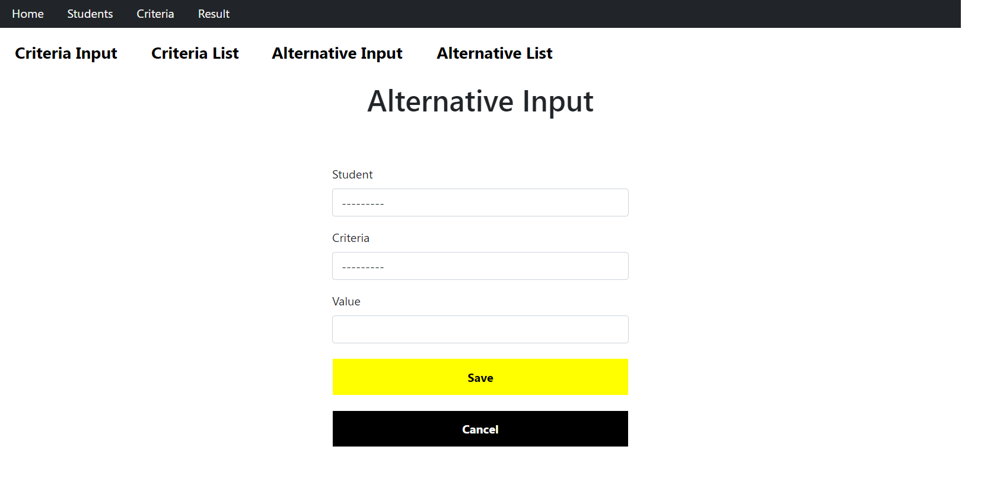
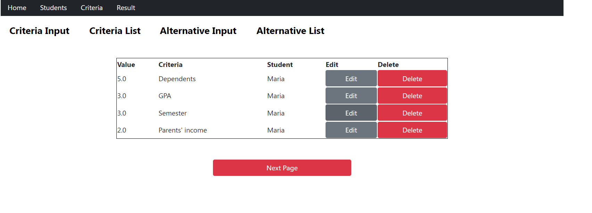
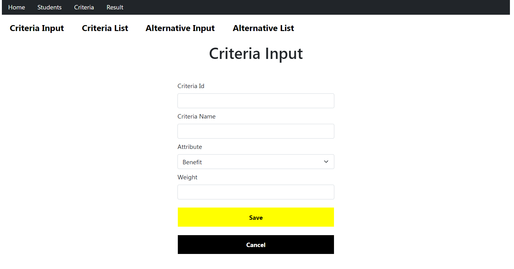
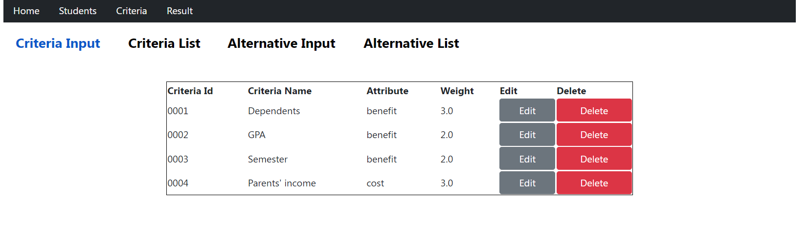
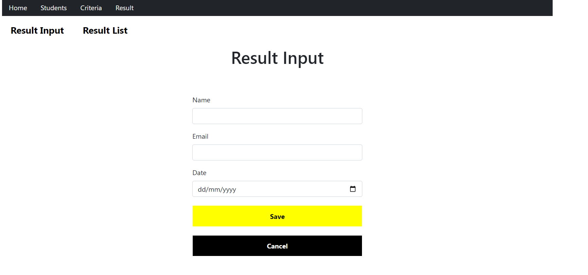
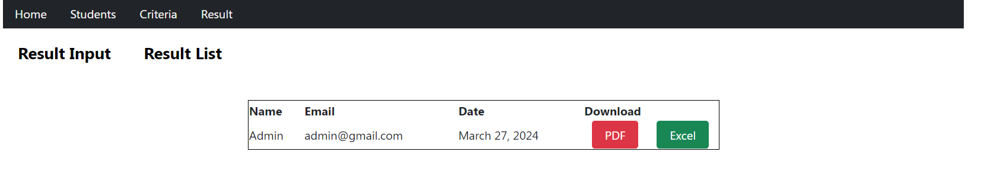

# Topsis Method In Determining Scholarships

TOPSIS (Technique for Order of Preference by Similarity to Ideal Solution) is a multi-criteria decision-making method used to determine the best alternative from a set of alternatives, taking into account multiple criteria or attributes. 
It is widely applied in various fields such as business, engineering, and environmental studies.

# Utilites 
1. Programming Language: Python
2. Framework : Django
3. Database : PostgreSQL

# Features
1. Performing CRUD for students and criteria
2. Perform criteria calculations on each students using TOPSIS formula build from several unit test.
3. Printing result in pdf and excel format.

# images
<figure style="margin-bottom:20px;">
  
  <figcaption>Student Input Form</figcaption>
</figure>

<hr>

<figure>
  
  <figcaption>Student List</figcaption>
</figure>

<hr>

<figure>
  
  <figcaption>Alternative Input</figcaption>
</figure>

<hr>

<figure>
  
  <figcaption>Alternative List</figcaption>
</figure>

<hr>

<figure>
  
  <figcaption>Criteria Input</figcaption>
</figure>

<hr>

<figure>
  
  <figcaption>Criteria List</figcaption>
</figure>

<hr>

<figure>
  
  <figcaption>Result Input</figcaption>
</figure>

<hr>

<figure>
  
  <figcaption>Result List</figcaption>
</figure>

# Run Django App
- create a Python virtual environment;
```bash
python -m venv [directory]
```

- running env
```bash
cd [directory]
.\Scripts\activate
```

- install the requirements in virtual environment;
```bash
python -m pip install -r requirements.txt
```

- configure postgresql;
```bash
'ENGINE': 'django.db.backends.postgresql',
'NAME': 'topsis-scholar',
'USER': 'postgres',
'PASSWORD': [configure],
'HOST': '127.0.0.1',
'PORT': '5432',
```

- Running django;
```bash
python manage.py runserver
```
